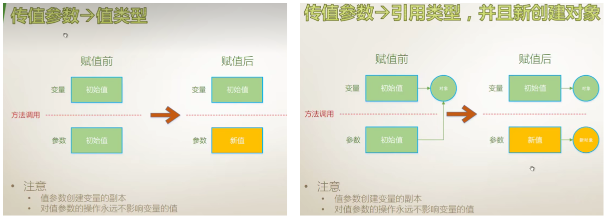
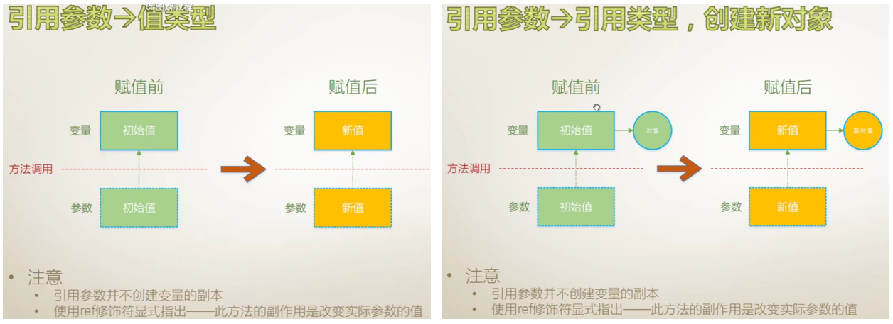
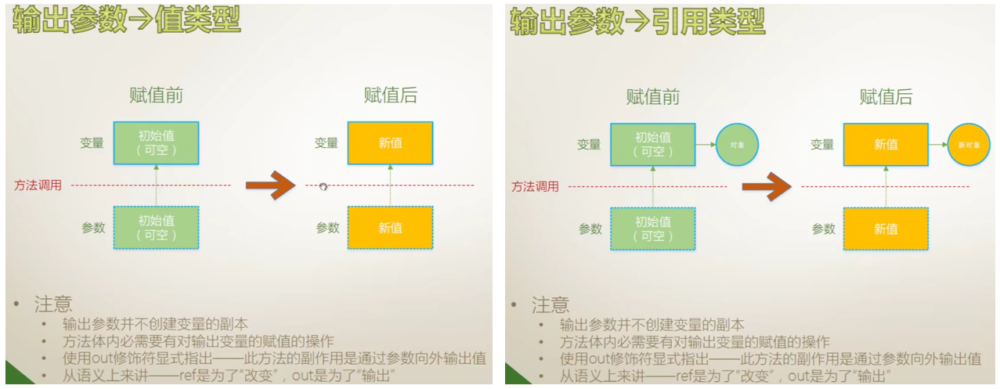
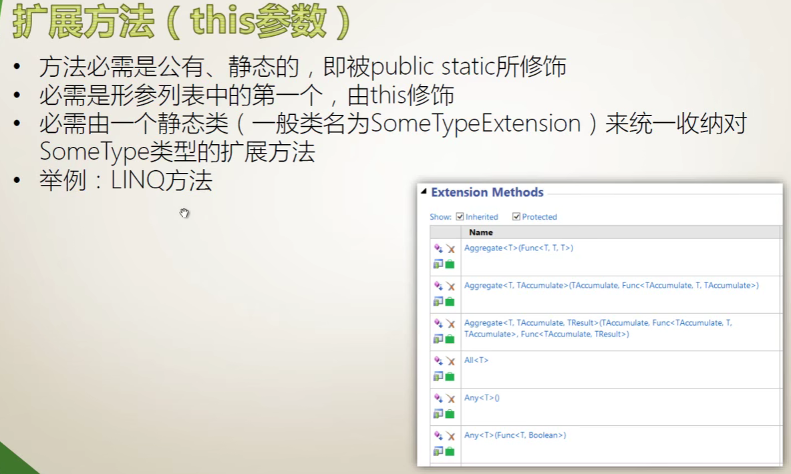
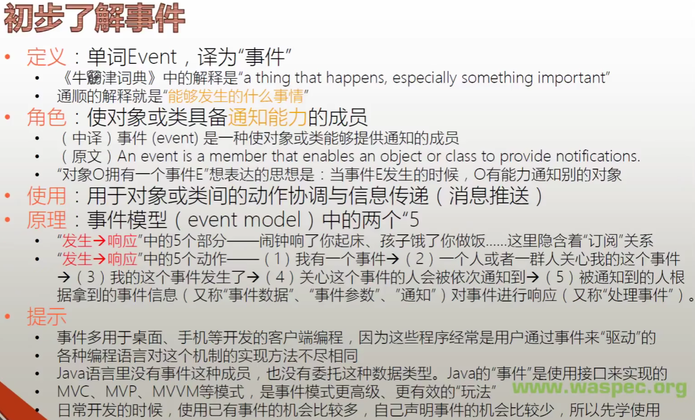
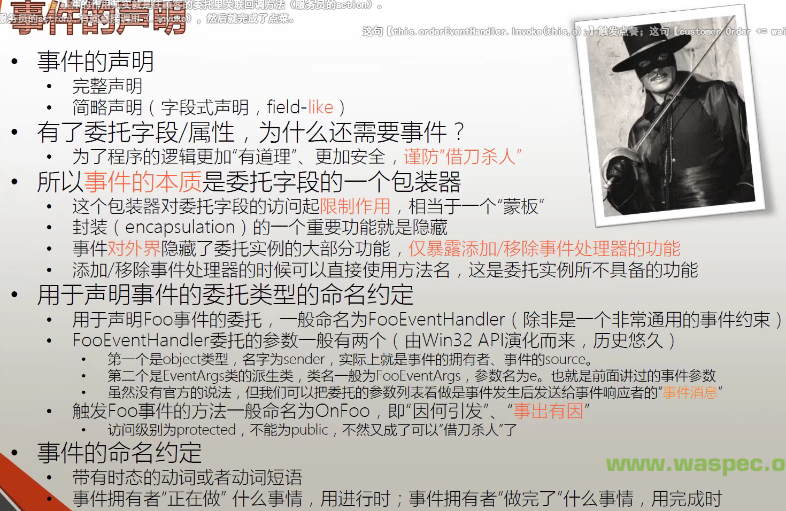
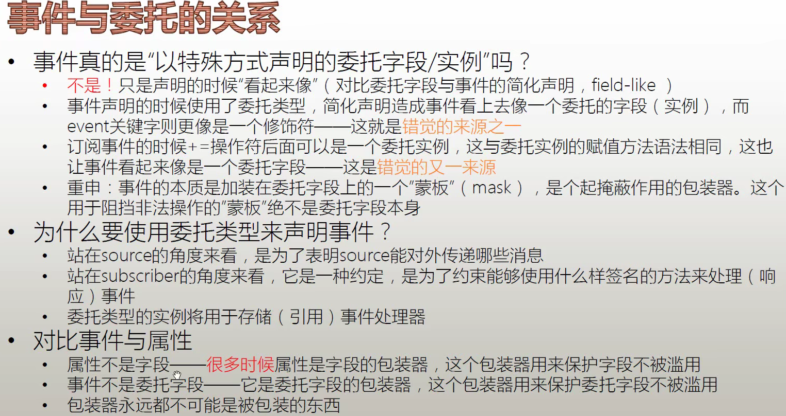

### 操作符详解1
#### 总结
- （声明/定义）不分家
- Parameter(Formal parameter)形参，指声明时的参数；Argument实参，调用时传入的参数。argument是值，parameter是变量，值与变量要匹配。
- new操作除了调用构造器，还能调用初始化器

---

### 操作符详解2
#### 总结
- 匿名类：var vr = new { name = "123", age = 13 };
- new作为关键字修饰派生类中函数，可隐藏父类同名函数（很少见）
- checked操作符，检查越界的，例如y = checked(++y) 如果y抵达最大值后继续加就会溢出，从而抛出异常；unchecked相反，不检查。还可以用花括号代码段上下文的形式使用
- delegate作为操作符已经被lambda表达式取代
- sizeof操作符，只用于获取结构体类型的大小，且最好是内建类型；如果非要用于自定义类型，要用unsafe+vs中项目设置允许unsafe
- 指针操作也是必须结构体类型，不能引用类型
- await操作符自己学习

---

### 操作符详解3

- 隐式类型转换
  - 不丢失精度
  - 子类向父类
  - 装箱
- 显示类型转换
  - 有可能丢失精度，甚至发生错误，即cast
  - 拆箱
  - 使用Convert类
  - ToString方法与各数据类型的Parse/TryParse方法
- 自定义类型转换操作符

> 自定义类型的转换
```csharp
// explicit 改为 implicit就不需要强制类型转换(T)了
class Stone{
    public int Age;
    public static explicit operator Monkey(Stone stone){
        Monkey m = new Monkey();
        m.Age = stone.Age / 500;
        return m;
    }
}
class Monkey{
    public int Age;
}
```

> is操作符的用例
```csharp
MyClass c = null;
// false 变量是MyClass，但所引用的实例是null
var result = c is MyClass;

BaseMyClass bc = new BaseMyClass();
result = bc is MyClass; // true 父类可
```

#### 总结
- 整数除0会除零异常，浮点数不会有，会有无穷大或者NaN（0除以0时）
- 浮点数也可以取余，但是尝试跑了下`3.3%1.1`居然等于`1.1`
- 显示数字的规范二进制：`Convert.ToString(v, 2).PadLeft(32, '0')`


---

### 字段、属性、索引器、常量

#### 总结
- 实例字段在每次创建实例初始化（构造函数/初始化列表），对应普通构造器`public MyClass`；静态字段在类型被运行环境加载时初始化（构造函数/初始化列表），对应的静态构造器：`static MyClass`，只执行一次。两种类型的默认值一般都是在声明时直接初始化。
- const只能在声明时初始化，readonly可以在声明时和构造函数内初始化
- const和static都是类型的，而不是实例的，在C#中都只能通过类型去访问，不能通过实例访问。（与C++不同，C#中，常量隶属于类型而不是对象，即没有“实例常量”`[“实例常量”的角色由只读实例字段来担当]`）
- 注意区分成员常量和局部常量
- 常量声明只能接受内建类型，如果想要自定义的结构体和类也是常量，只能用静态只读字段。

---

### 各类参数

#### 1、值参数

#### 2、引用参数

#### 3、输出参数
- 输出参数不要求传入前先赋值（不同于引用参数），但是方法体内要求赋值



#### 4、数组参数
- 数组参数：一个参数列表只能有一个，且只能是最后一个。


```csharp
// 例子1
Console.WriteLine(string format, params object[] arg);
// 例子2
string s = "Tom;Tim.Amy?Lisa";
s.Split(';','.','?'); // 返回分割好的string数组
```
#### 5、具名参数（使用方法）
```csharp
class MyClass{
  static void Main(string[] args){
    // 1、提高代码可读性；2、参数的位置不再受约束
    PrintInfo(name:"Tim", age:32);
  }
  static void PrintInfo(string name, int age){
    Console.WriteLine("Hello {0}, you are{1}", name, age);
  }
}
```
#### 6、可选参数（默认参数）
- 与C++类似，不赘述了

#### 7、扩展方法（this参数）
- 方法必须是

```csharp
class MyClass{
  static void Main(string[] args){
    double x = 3.1415926;
    double y = x.Round(4);
    Console.WriteLine(y); // 3.1416
  }
}
// 扩展
static class DoubleExtension{
  public static double Round(this double intput, int digits){
    double result = Math.Round(intput, digits);
    return result;
  }
} 
```


---

### 委托详解
- 委托声明是类级别的，最好放在命名空间内
- `action.BeginInvoke(callback, object)`是隐式的异步调用（自动生成分支线程）
- 应适时地使用接口取代一些委托的使用（Java就完全用接口替代了委托）

---

### 事件详解
#### 初步了解事件





---